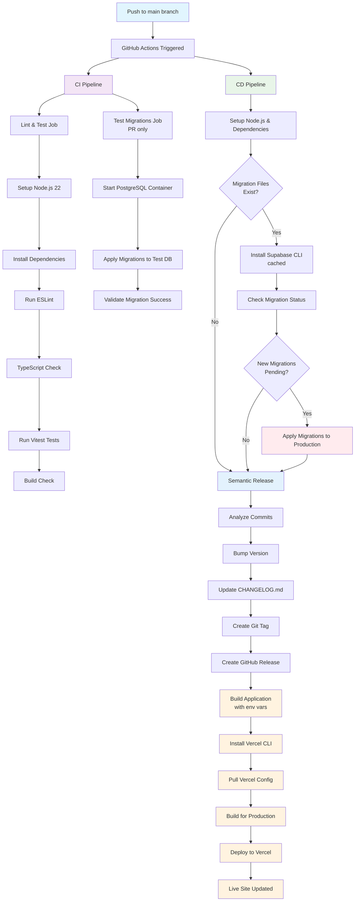

# 🏥 Community Health Clinic

A full-stack demo application for a fictional community health clinic, built with [Next.js](https://nextjs.org), [Supabase](https://supabase.com), [Tailwind CSS](https://tailwindcss.com), and [shadcn/ui](https://ui.shadcn.com). This project showcases developer skills across frontend, backend, and infrastructure, and is designed as a polished portfolio piece for hiring teams.

---

## 🚀 Features

- **Patient Intake & Form Capture**  
  Collect demographic, medical history, and contact information.

- **Appointment Scheduling & Reminders**  
  Book visits, send reminders, and support follow-up logic.

- **Insurance Eligibility Check**  
  Flag basic eligibility (yes/no) based on minimal criteria.

- **Provider Dashboard**  
  Track wait times, no-show rates, and appointment flow.

### ⚡ Stretch Goals (Planned)

- Claims tracking integration
- Point-of-care inventory
- Clinical decision alerts
- Mobile outreach module for on-site services (sync-capable)

---

## 🛠️ Tech Stack

<table>
  <tr>
    <td align="center" width="96">
      <a href="https://nextjs.org">
        
      </a>
      <br>Next.js
    </td>
    <td align="center" width="96">
      <a href="https://www.typescriptlang.org">
        
      </a>
      <br>TypeScript
    </td>
    <td align="center" width="96">
      <a href="https://tailwindcss.com">
        
      </a>
      <br>Tailwind
    </td>
    <td align="center" width="96">
      <a href="https://ui.shadcn.com">
        
      </a>
      <br>shadcn/ui
    </td>
  </tr>
  <tr>
    <td align="center" width="96"> 
      <a href="https://supabase.com">
        
      </a>
      <br>Supabase
    </td>
    <td align="center" width="96">
      <a href="https://www.postgresql.org">
        
      </a>
      <br>PostgreSQL
    </td>
    <td align="center" width="96">
      <a href="https://www.docker.com">
        
      </a>
      <br>Docker
    </td>
    <td align="center" width="96">
      <a href="https://vercel.com">
        
      </a>
      <br>Vercel
    </td>
  </tr>
  <tr>
    <td align="center" width="96">
      <a href="https://eslint.org">
        
      </a>
      <br>ESLint
    </td>
    <td align="center" width="96">
      <a href="https://prettier.io">
        
      </a>
      <br>Prettier
    </td>
    <td align="center" width="96">
      <a href="https://vitest.dev">
        
      </a>
      <br>Vitest
    </td>
    <td align="center" width="96">
      <a href="https://github.com/features/actions">
        
      </a>
      <br>GitHub Actions
    </td>
  </tr>
</table>

---

## 🖥️ Local Development

### Prerequisites

- Node.js >= 20
- Docker Desktop

### Getting Started

```bash
# 1. Clone the repo
git clone https://github.com/your-org/community-health-clinic.git
cd community-health-clinic

# 2. Start Supabase (ensure docker desktop is running first!)
npm run sb:start

# 3. Run the app
npm install
npm run dev
```

### Environment Variables

Copy `.env.example` to `.env.local` and update values as needed.  
Note: Supabase secrets will be available via local Docker if using `supabase start`.

---

## 🌐 Live Demo

👉 [Live Site on Vercel](https://dsd-east-coast-goats.vercel.app/)

---

## 👥 Contributing

We welcome clean, well-documented contributions.

### Steps

1. clone this repo
2. Create a branch: `git checkout -b feature/your-feature-name`
3. Make your changes and commit
4. Push: `git push -u origin head`
5. Open a pull request

See [`CONTRIBUTING.md`](./CONTRIBUTING.md) for code style and review guidelines.

---

## 📸 Screenshots

> Add Loom demo or UI screenshots here.

---

## 📌 Project Status

✅ MVP complete  
🛠️ Stretch goals in progress  
📨 [Meet the devs](./TEAM.md)

---

## 🎯 Why This Project?

This project demonstrates:

- Full-stack system design
- Component-based frontend architecture
- Scalable developer tooling and deployment

# Our Team

## Core Contributors

<table>
  <tr>
    <th>Avatar</th>
    <th>Name</th>
    <th>Role</th>
    <th>GitHub</th>
    <th>LinkedIn</th>
  </tr>
  <tr>
    <td></td>
    <td>Daniel Gorbachev</td>
    <td>Full Stack Developer</td>
    <td><a href="https://github.com/dgorik">@dgorik</a></td>
    <td><a href="https://linkedin.com/in/johndoe">LinkedIn Profile</a></td>
  </tr>
  <tr>
    <td></td>
    <td>Dillon Gotez</td>
    <td>Full Stack Developer</td>
    <td><a href="https://github.com/Dillon-Goetz">@Dillon-Goetz</a></td>
    <td><a href="https://linkedin.com/in/janesmith">LinkedIn Profile</a></td>
  </tr>
  <tr>
    <td></td>
    <td>Elvis Espinoza</td>
    <td>Full Stack Developer</td>
    <td><a href="https://github.com/elvisEspinozaN">@elvisEspinozaN</a></td>
    <td><a href="https://linkedin.com/in/janesmith">LinkedIn Profile</a></td>
  </tr>
  <tr>
    <td></td>
    <td>Peter Tasca</td>
    <td>Full Stack Developer</td>
    <td><a href="https://github.com/tascapeter514">@tascapeter514</a></td>
    <td><a href="https://linkedin.com/in/janesmith">LinkedIn Profile</a></td>
  </tr>
  <tr>
    <td></td>
    <td>Roosiel Agramonte</td>
    <td>Full Stack Developer</td>
    <td><a href="https://github.com/rzagramonte">@rzagramonte</a></td>
    <td><a href="https://linkedin.com/in/janesmith">LinkedIn Profile</a></td>
  </tr>
  <tr>
    <td></td>
    <td>Walter Furrer</td>
    <td>Full Stack Developer</td>
    <td><a href="https://github.com/watlerfurrer">@watlerfurrer</a></td>
    <td><a href="https://linkedin.com/in/janesmith">LinkedIn Profile</a></td>
  </tr>
  <tr>
    <td colspan="5"><hr/></td>
  </tr>
  <tr>
    <td></td>
    <td>Khurram</td>
    <td>Cohort Lead</td>
    <td><a href="https://github.com/destocot">@destocot</a></td>
    <td>
    <div style="flex-direction: column; align-items: center; display: flex; justify-content: center; height: 50px;">
    <a href="https://www.linkedin.com/in/khurram-ali1">LinkedIn Profile</a>
    <a href="https://www.youtube.com/@GiraffeReactor">YouTube Channel</a>
    </td>
    </div>
  </tr>
  <tr>
    <td></td>
    <td>Noah Harris</td>
    <td>Cohort Lead</td>
    <td><a href="https://github.com/ncharris93">@ncharris93</a></td>
    <td><a href="https://www.linkedin.com/in/nharris31/">LinkedIn Profile</a></td>
  </tr>
</table>

# CI/CD Pipeline

- Blue: Developer actions
- Purple: CI Pipeline (testing & validation)
- Green: CD Pipeline (migrations, releases & deployment)
- Orange: Vercel deployment steps
- Red: Critical migration step
- Light Blue: Release process


